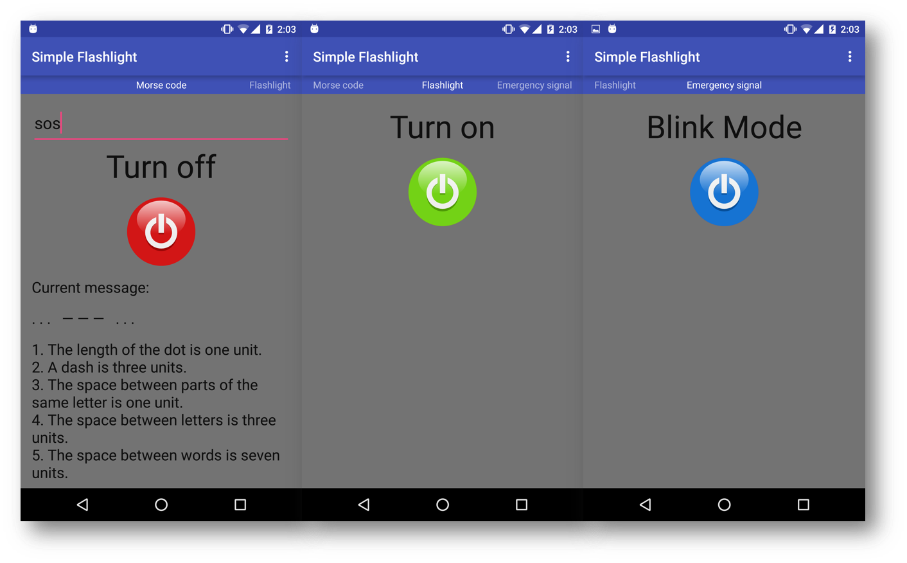

# Flashlight with Morse Code
 

Flashlight with Morse Code and no Ads which works as a Service (it works when the app is in background).  

## Functionality
* Switch On/Off.
* Morse Code [(03acde1) commit.](https://github.com/dmytroKarataiev/SimpleFlashlight/commit/03acde1851b01802823e2d7e044bdaf1f1a31297)
* Full Marshmallow support (Camera2 API, CameraManager).
* Emergency state with a SEWS signal and a flashing background.

## Future development
* Morse Code speed.
* Sending an SMS of a location to most important people.

## Used technologies
* Service, Intents.
* AsyncTask.
* Camera, Camera2 APIs.

## Content from the Internet
* App Icon - http://graphiccave.com/project/flashlight-icon-vector-and-png-free-download/
* Power Buttons - http://www.freestockphotos.biz/stockphoto/15104
* Emergency Signal - http://www.disaster.qld.gov.au/Warnings_and_Alerts/About_SEWS.html

License
-------

	The MIT License (MIT)

	Copyright (c) 2016 Dmytro Karataiev

	Permission is hereby granted, free of charge, to any person obtaining a copy
	of this software and associated documentation files (the "Software"), to deal
	in the Software without restriction, including without limitation the rights
	to use, copy, modify, merge, publish, distribute, sublicense, and/or sell
	copies of the Software, and to permit persons to whom the Software is
	furnished to do so, subject to the following conditions:

	The above copyright notice and this permission notice shall be included in all
	copies or substantial portions of the Software.

	THE SOFTWARE IS PROVIDED "AS IS", WITHOUT WARRANTY OF ANY KIND, EXPRESS OR
	IMPLIED, INCLUDING BUT NOT LIMITED TO THE WARRANTIES OF MERCHANTABILITY,
	FITNESS FOR A PARTICULAR PURPOSE AND NONINFRINGEMENT. IN NO EVENT SHALL THE
	AUTHORS OR COPYRIGHT HOLDERS BE LIABLE FOR ANY CLAIM, DAMAGES OR OTHER
	LIABILITY, WHETHER IN AN ACTION OF CONTRACT, TORT OR OTHERWISE, ARISING FROM,
	OUT OF OR IN CONNECTION WITH THE SOFTWARE OR THE USE OR OTHER DEALINGS IN THE
	SOFTWARE.